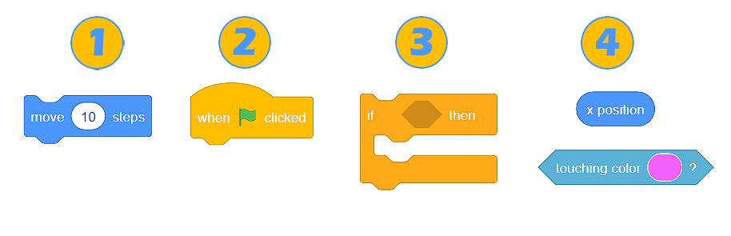

# Functions

We introduced the world of Scratch. introducing the stage and the sprites that can live on that stage. And saw how we could change the way the sprites looked by giving them costumes, and giving them some sounds, and also add some backdrops to our stage to make it look a little bit more interesting.

The following informations are directly from [petlja](https://petlja.org/biblioteka/r/lekcije/BlockBasedProgScratch/blocks).

### Blocks (functions)

Computer programs are sets of commands, which we use to explain to the computer how to complete a certain task or solve a problem. Given that most programming languages ​​are textual, developers often type commands.

In the visual programming language Scratch, we don’t write commands, but instead we use blocks, which represent them. We create programs by arranging (stacking) blocks in the appropriate order.

### Types of Blocks in Scratch

There are 4 types of blocks in Scratch:

<figure><figcaption>
Type of blocks
</figcaption></figure>

1. Command blocks.
2. Blocks which link events with the running of the program.
3. Blocks which control the running of the program.
4. Blocks which report a certain value (function blocks).

### Training video



### Example

**Scratch cat**

* Glide the cat to the four corners of the screen.


Source code


### Challenge

**Bear trip**


